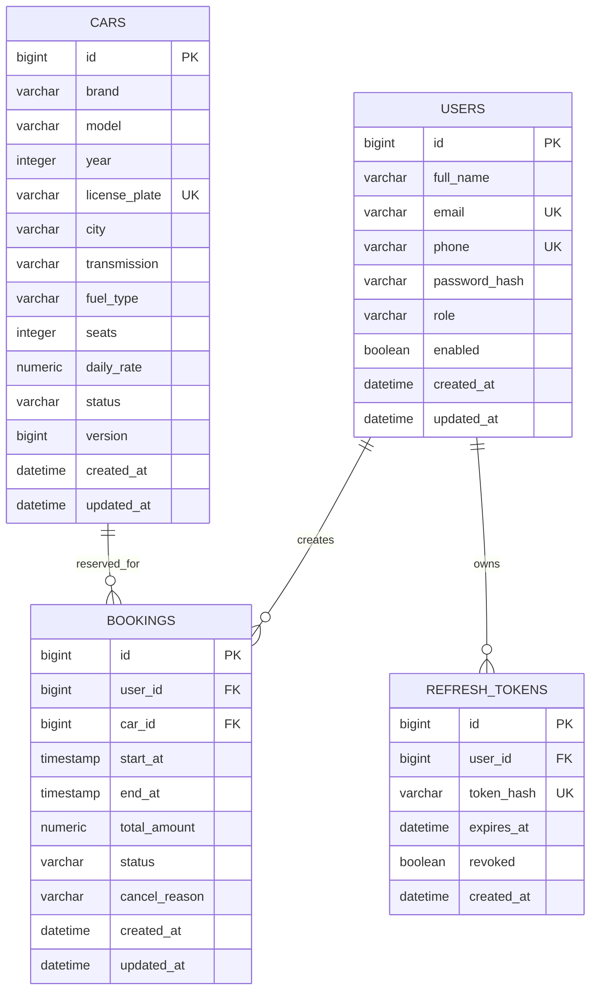

# Database Design

## ER Diagram

## Schema

The executable SQL schema is maintained in `src/main/resources/db/migration/V1__init_schema.sql`.

## Booking Concurrency

Bookings lock the selected car row with `PESSIMISTIC_WRITE` inside a transaction, then check active interval overlap using:

`existing.start_at < requested.end_at AND existing.end_at > requested.start_at`

The composite index `idx_bookings_car_status_interval` supports overlap checks for confirmed bookings on MySQL.
